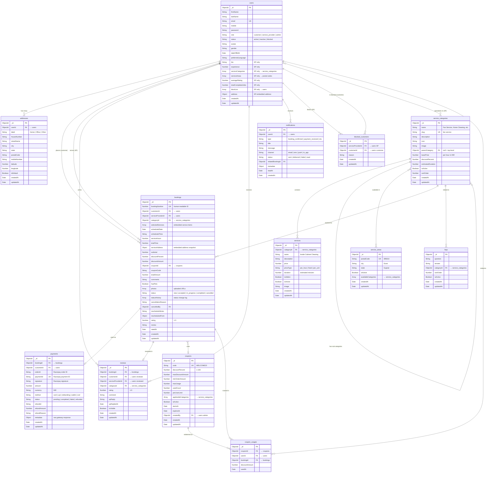
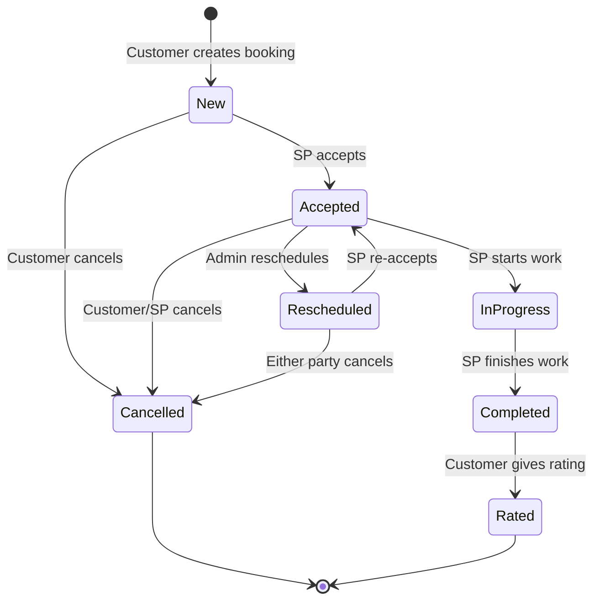
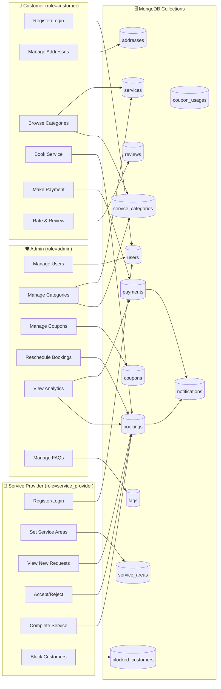
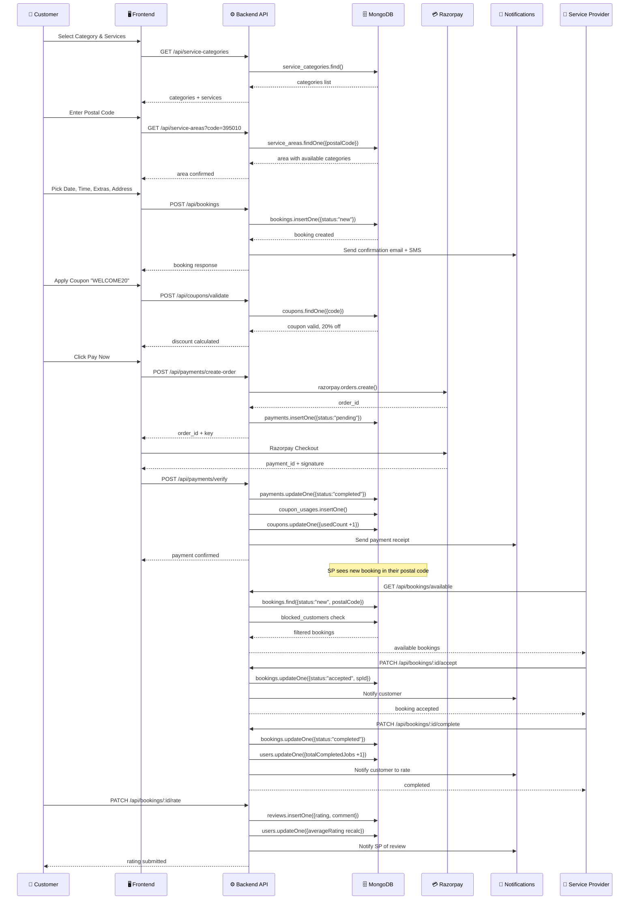

# Helperland — MongoDB Database Diagram Design

> 13 Collections | 3 User Roles | 12 Service Categories | Full Booking Lifecycle

---

## 1. Entity Relationship Diagram (ERD)



---

## 2. Booking Lifecycle — State Machine



---

## 3. Service Category Hierarchy

```mermaid
graph TD
    ROOT["🏠 Helperland Services"]

    ROOT --> HC["🧹 Home Cleaning<br/>₹500/hr"]
    ROOT --> FS["🌀 Fan Service<br/>₹300/hr"]
    ROOT --> CS["🗄️ Cupboard Service<br/>₹400/hr"]
    ROOT --> BS["🛏️ Bed Service<br/>₹350/hr"]
    ROOT --> CL["🔝 Ceiling Service<br/>₹600/hr"]
    ROOT --> ES["⚡ Electrical Service<br/>₹400/hr"]
    ROOT --> PS["🔧 Plumbing Service<br/>₹450/hr"]
    ROOT --> AC["❄️ AC Service<br/>₹700/hr"]
    ROOT --> AR["🔩 Appliance Repair<br/>₹500/hr"]
    ROOT --> PC["🐛 Pest Control<br/>₹800/hr"]
    ROOT --> PT["🎨 Painting<br/>₹1000/hr"]
    ROOT --> CP["🪚 Carpentry<br/>₹500/hr"]

    HC --> HC1["Room Cleaning"]
    HC --> HC2["Kitchen Cleaning"]
    HC --> HC3["Bathroom Cleaning"]
    HC --> HC4["Deep Cleaning"]

    FS --> FS1["Ceiling Fan Clean"]
    FS --> FS2["Exhaust Fan Repair"]
    FS --> FS3["Fan Installation"]

    CS --> CS1["Cupboard Cleaning"]
    CS --> CS2["Organization"]
    CS --> CS3["Wardrobe Deep Clean"]

    BS --> BS1["Mattress Cleaning"]
    BS --> BS2["Bed Bug Treatment"]
    BS --> BS3["Linen Change"]

    CL --> CL1["Ceiling Cleaning"]
    CL --> CL2["Ceiling Painting"]
    CL --> CL3["False Ceiling Repair"]

    ES --> ES1["Wiring Repair"]
    ES --> ES2["Switch/Socket Fix"]
    ES --> ES3["Light Installation"]

    PS --> PS1["Pipe Repair"]
    PS --> PS2["Tap Installation"]
    PS --> PS3["Drain Cleaning"]

    AC --> AC1["AC Cleaning"]
    AC --> AC2["AC Repair"]
    AC --> AC3["AC Gas Refill"]
    AC --> AC4["AC Installation"]

    AR --> AR1["Washing Machine"]
    AR --> AR2["Refrigerator"]
    AR --> AR3["Microwave"]
    AR --> AR4["Geyser"]

    PC --> PC1["Cockroach"]
    PC --> PC2["Termite"]
    PC --> PC3["Mosquito"]
    PC --> PC4["Rodent"]

    PT --> PT1["Interior Painting"]
    PT --> PT2["Exterior Painting"]
    PT --> PT3["Texture Painting"]

    CP --> CP1["Furniture Repair"]
    CP --> CP2["Door Fix"]
    CP --> CP3["Cabinet Making"]

    style ROOT fill:#1a237e,color:#fff,stroke:#0d47a1
    style HC fill:#2e7d32,color:#fff
    style FS fill:#e65100,color:#fff
    style CS fill:#4527a0,color:#fff
    style BS fill:#c62828,color:#fff
    style CL fill:#00838f,color:#fff
    style ES fill:#f9a825,color:#000
    style PS fill:#1565c0,color:#fff
    style AC fill:#00695c,color:#fff
    style AR fill:#6a1b9a,color:#fff
    style PC fill:#bf360c,color:#fff
    style PT fill:#ad1457,color:#fff
    style CP fill:#795548,color:#fff
```



---

## 4. User Role Data Flow



---

## 5. Booking Data Flow — Complete Journey



---

## 6. Collection Relationship Map (Visual)

```
┌─────────────────────────────────────────────────────────────────────────────┐
│                         HELPERLAND — MongoDB Schema                        │
├─────────────────────────────────────────────────────────────────────────────┤
│                                                                             │
│  ┌──────────┐    1:N     ┌────────────┐    1:N     ┌──────────────┐        │
│  │  users   │───────────▶│  addresses │            │ notifications│        │
│  │          │            └────────────┘            └──────────────┘        │
│  │ customer │◀───────────────────────────────────────────┐                  │
│  │ SP       │    1:N     ┌────────────┐                  │ 1:N              │
│  │ admin    │───────────▶│  bookings  │─────────────────▶│                  │
│  │          │            │            │                                      │
│  │          │◀───SP──────│ customerId │    1:1     ┌──────────┐             │
│  │          │            │ SPId       │───────────▶│ payments │             │
│  │          │            │ categoryId │            └──────────┘             │
│  │          │            │ couponId   │                                      │
│  │          │            │            │    1:1     ┌──────────┐             │
│  │          │            │            │───────────▶│ reviews  │             │
│  └─────┬────┘            └─────┬──────┘            └──────────┘             │
│        │                       │                                             │
│        │ 1:N                   │ N:1                                         │
│        ▼                       ▼                                             │
│  ┌──────────────┐     ┌────────────────────┐    1:N    ┌──────────┐        │
│  │   blocked    │     │ service_categories │──────────▶│ services │        │
│  │  customers   │     │                    │           └──────────┘        │
│  └──────────────┘     │  Home Cleaning     │                                │
│                        │  Fan Service       │    N:M    ┌───────────────┐   │
│                        │  Cupboard Service  │◀────────▶│ service_areas │   │
│  ┌──────────┐         │  Bed Service       │           └───────────────┘   │
│  │  faqs    │────────▶│  Ceiling Service   │                                │
│  └──────────┘   N:1   │  Electrical        │                                │
│                        │  Plumbing          │                                │
│  ┌──────────┐         │  AC Service        │                                │
│  │ coupons  │         │  Appliance Repair  │                                │
│  │          │  1:N    │  Pest Control      │                                │
│  │          │────────▶│  Painting          │                                │
│  └────┬─────┘         │  Carpentry         │                                │
│       │ 1:N           └────────────────────┘                                │
│       ▼                                                                      │
│  ┌──────────────┐                                                           │
│  │coupon_usages │                                                           │
│  └──────────────┘                                                           │
│                                                                             │
└─────────────────────────────────────────────────────────────────────────────┘
```

---

## 7. Index Strategy

```
COLLECTION              INDEX                                    TYPE
─────────────────────────────────────────────────────────────────────────
users                   { email: 1 }                             unique
users                   { role: 1, status: 1 }                   compound
users                   { serviceAreas: 1 }                      multikey

service_categories      { slug: 1 }                              unique
service_categories      { parentCategory: 1 }                    single
service_categories      { isActive: 1 }                          single

services                { categoryId: 1 }                        single
services                { isAddon: 1, isActive: 1 }              compound

addresses               { userId: 1 }                            single
addresses               { postalCode: 1 }                        single

bookings                { customerId: 1, status: 1 }             compound
bookings                { serviceProviderId: 1, status: 1 }      compound
bookings                { "serviceAddress.postalCode": 1 }       nested
bookings                { scheduledDate: 1 }                     single
bookings                { bookingNumber: 1 }                     unique

payments                { bookingId: 1 }                         single
payments                { paymentId: 1 }                         unique
payments                { customerId: 1 }                        single

coupons                 { code: 1 }                              unique
coupons                 { isActive: 1, expiresAt: 1 }            compound

coupon_usages           { couponId: 1, userId: 1 }               compound

reviews                 { serviceProviderId: 1, rating: 1 }      compound
reviews                 { customerId: 1 }                        single
reviews                 { categoryId: 1 }                        single

service_areas           { postalCode: 1 }                        unique
service_areas           { city: 1 }                              single

notifications           { userId: 1, readAt: 1 }                 compound
notifications           { createdAt: -1 }                        descending

faqs                    { isActive: 1, sortOrder: 1 }            compound

blocked_customers       { serviceProviderId: 1, customerId: 1 }  unique compound
```

---

## 8. Migration Summary: db.json → MongoDB

```
  OLD (db.json)                    NEW (MongoDB)
  ─────────────                    ─────────────
  ┌──────────────┐                 ┌──────────────────┐
  │ user[]       │ ──────────────▶ │ users             │
  │ (22 records) │                 │ (normalized)      │
  └──────────────┘                 └──────────────────┘

  ┌──────────────┐                 ┌──────────────────┐
  │ postalCode[] │ ──────────────▶ │ service_areas     │
  │ (6 records)  │                 │ (+ city, state)   │
  └──────────────┘                 └──────────────────┘

  ┌──────────────┐                 ┌──────────────────┐
  │ Bookservice[]│ ──────────────▶ │ bookings          │
  │ (10 records) │                 │ + payments        │
  │              │                 │ + reviews         │
  └──────────────┘                 └──────────────────┘

  ┌──────────────┐                 ┌──────────────────┐
  │ Address[]    │ ──────────────▶ │ addresses         │
  │ (9 records)  │                 │ (+ label, geo)    │
  └──────────────┘                 └──────────────────┘

  ┌──────────────┐                 ┌──────────────────┐
  │ (hardcoded)  │ ──────────────▶ │ service_categories│
  │ ExtraService │                 │ services          │
  │ $20/hr rate  │                 │ (12 categories)   │
  └──────────────┘                 └──────────────────┘

  ┌──────────────┐                 ┌──────────────────┐
  │  (none)      │ ──────────────▶ │ notifications     │
  │              │                 │ coupon_usages     │
  │              │                 │ blocked_customers │
  └──────────────┘                 └──────────────────┘
```

---

## 9. Collection Statistics (Expected)

| # | Collection | Est. Records | Avg Doc Size | Growth Rate |
|---|---|---|---|---|
| 1 | users | 100s–1000s | ~1 KB | Moderate |
| 2 | service_categories | 50–100 | ~0.5 KB | Low (admin-managed) |
| 3 | services | 100–200 | ~0.5 KB | Low (admin-managed) |
| 4 | addresses | 500–5000 | ~0.3 KB | Moderate |
| 5 | bookings | 1000s–100K+ | ~2 KB | High |
| 6 | payments | 1000s–100K+ | ~1 KB | High (1:1 with bookings) |
| 7 | coupons | 10–100 | ~0.5 KB | Low |
| 8 | coupon_usages | 100s–10K | ~0.2 KB | Moderate |
| 9 | reviews | 100s–50K | ~0.5 KB | Moderate |
| 10 | service_areas | 50–500 | ~0.3 KB | Low |
| 11 | notifications | 10K–1M+ | ~0.5 KB | Very High (TTL recommended) |
| 12 | faqs | 20–100 | ~0.5 KB | Low |
| 13 | blocked_customers | 10–500 | ~0.2 KB | Low |
