# 🏠 Working-Desk (Helperland) — Full System Design

> **A Home Cleaning Service Booking Platform** connecting Customers, Service Providers, and Admins.

---

## Table of Contents

1. [Project Overview](#1-project-overview)
2. [Use Case Diagram](#2-use-case-diagram)
3. [System Architecture Diagram](#3-system-architecture-diagram)
4. [Component Diagram](#4-component-diagram)
5. [Entity Relationship Diagram (ERD)](#5-entity-relationship-diagram-erd)
6. [Class Diagram](#6-class-diagram)
7. [Sequence Diagrams](#7-sequence-diagrams)
   - [Login & Authentication](#71-login--authentication-sequence)
   - [User Registration](#72-user-registration-sequence)
   - [Book a Service (Customer)](#73-book-a-service-customer-sequence)
   - [Accept Service Request (Service Provider)](#74-accept-service-request-service-provider-sequence)
   - [Forgot Password Flow](#75-forgot-password-sequence)
   - [Admin Manage Service Requests](#76-admin-manage-service-requests-sequence)
   - [Block Customer (Service Provider)](#77-block-customer-sequence)
8. [Activity Diagrams](#8-activity-diagrams)
   - [Customer Booking Flow](#81-customer-booking-activity)
   - [Service Provider Flow](#82-service-provider-activity)
   - [Admin Flow](#83-admin-activity)
9. [State Machine Diagram — Booking Lifecycle](#9-state-machine-diagram--booking-lifecycle)
10. [Deployment Diagram](#10-deployment-diagram)
11. [Data Flow Diagram (DFD)](#11-data-flow-diagram-dfd)
12. [Frontend Page & Routing Map](#12-frontend-page--routing-map)
13. [Redux State Architecture](#13-redux-state-architecture)
14. [REST API Design](#14-rest-api-design)
15. [PostgreSQL Database Schema](#15-postgresql-database-schema)
16. [Security Design](#16-security-design)
17. [Business Logic Rules](#17-business-logic-rules)
18. [Technology Stack](#18-technology-stack)

---

## 1. Project Overview

**Working-Desk (Helperland)** is a multi-role home cleaning service platform with three distinct user types:

| Role | `userTypeId` | Dashboard Route | Capabilities |
|------|-------------|-----------------|--------------|
| **Customer** | `0` | `/history` | Book services, view history, manage addresses, rate SPs |
| **Service Provider (SP)** | `1` | `/upcoming` | Accept/decline jobs, view schedule, block customers, manage ratings |
| **Admin** | `2` | `/srequest` | Manage all users, service requests, finance, content |

**Current Stack:**
- Frontend: React 17 + TypeScript + MUI v5 + Redux Toolkit (port 3000)
- Backend: Node.js + JSON-Server + custom Express routes (port 5000)
- Storage: `db.json` flat file

---

## 2. Use Case Diagram


```mermaid
%%{init: {'theme': 'default'}}%%
graph TB
    subgraph Actors
        C(["👤 Customer"])
        SP(["🧹 Service Provider"])
        ADM(["🛡 Admin"])
        SYS(["⚙️ System"])
    end

    subgraph PUBLIC["Public (Unauthenticated)"]
        UC1([View Homepage])
        UC2([View Prices & Services])
        UC3([View FAQ])
        UC4([View Contact Page])
        UC5([View About / Blog])
        UC6([Register Account])
        UC7([Login])
        UC8([Forgot Password])
        UC9([Reset Password via Token])
        UC10([View Become a Pro])
    end

    subgraph CUSTOMER["Customer Portal"]
        UC11([Book a Service])
        UC12([Select Rooms / Bath / Date / Time])
        UC13([Choose Extra Services])
        UC14([View Payment Summary])
        UC15([View Service History])
        UC16([View Dashboard])
        UC17([Manage Addresses])
        UC18([View Favourite Providers])
        UC19([Rate Service Provider])
        UC20([Cancel Booking])
        UC21([Update Profile / Settings])
    end

    subgraph SP_UC["Service Provider Portal"]
        UC22([View New Service Requests])
        UC23([Accept Service Request])
        UC24([Cancel Accepted Service])
        UC25([View Upcoming Services])
        UC26([View Service History])
        UC27([View My Ratings])
        UC28([Block a Customer])
        UC29([Unblock a Customer])
        UC30([Complete Profile / Settings])
        UC31([View Service Schedule])
    end

    subgraph ADMIN_UC["Admin Portal"]
        UC32([View All Service Requests])
        UC33([Filter / Search Service Requests])
        UC34([Reschedule Service Request])
        UC35([Cancel Service Request])
        UC36([Assign SP to Request])
        UC37([View All Users])
        UC38([Activate / Deactivate User])
        UC39([Manage Coupon Codes])
        UC40([Manage Zip Codes])
        UC41([Manage Finance / Transactions])
        UC42([Manage FAQs / Content])
        UC43([Manage Newsletter])
    end

    subgraph SYS_UC["System Automated"]
        UC44([Send Password Reset Email])
        UC45([Check SP Schedule Conflict])
        UC46([Calculate Payment])
        UC47([Redirect by Role on Login])
    end

    C --> UC1 & UC2 & UC3 & UC6 & UC7 & UC8
    C --> UC11 & UC12 & UC13 & UC14 & UC15 & UC16
    C --> UC17 & UC18 & UC19 & UC20 & UC21
    SP --> UC7 & UC22 & UC23 & UC24 & UC25
    SP --> UC26 & UC27 & UC28 & UC29 & UC30 & UC31
    ADM --> UC7 & UC32 & UC33 & UC34 & UC35
    ADM --> UC36 & UC37 & UC38 & UC39 & UC40 & UC41 & UC42 & UC43
    SYS --> UC44 & UC45 & UC46 & UC47

    UC8 -.->|triggers| UC44
    UC9 -.->|uses| UC44
    UC11 -.->|includes| UC46
    UC23 -.->|includes| UC45
```

---

## 3. System Architecture Diagram

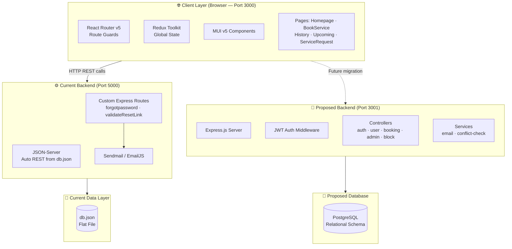
```mermaid
%%{init: {'theme': 'default'}}%%
graph TB
    subgraph CLIENT["🌐 Client Layer (Browser — Port 3000)"]
        direction TB
        RR[React Router v5<br/>Route Guards]
        REDUX[Redux Toolkit<br/>Global State]
        MUI[MUI v5 Components]
        PAGES[Pages: Homepage · BookService<br/>History · Upcoming · ServiceRequest]
    end

    subgraph CURRENT_BACKEND["⚙️ Current Backend (Port 5000)"]
        direction TB
        JS[JSON-Server<br/>Auto REST from db.json]
        CE[Custom Express Routes<br/>forgotpassword · validateResetLink]
        SM[Sendmail / EmailJS]
    end

    subgraph DATA["💾 Current Data Layer"]
        DB[(db.json<br/>Flat File)]
    end

    subgraph PROPOSED_BACKEND["🚀 Proposed Backend (Port 3001)"]
        direction TB
        EXP[Express.js Server]
        JWT_MW[JWT Auth Middleware]
        CTRL[Controllers<br/>auth · user · booking · admin · block]
        SVC[Services<br/>email · conflict-check]
    end

    subgraph PROPOSED_DB["🐘 Proposed Database"]
        PG[(PostgreSQL<br/>Relational Schema)]
    end

    CLIENT -->|HTTP REST calls| CURRENT_BACKEND
    CURRENT_BACKEND --> DATA
    CLIENT -.->|Future migration| PROPOSED_BACKEND
    PROPOSED_BACKEND --> PROPOSED_DB
    CE --> SM
```

---

## 4. Component Diagram


```mermaid
%%{init: {'theme': 'default'}}%%
graph TB
    subgraph APP["App.js — React Router"]
        direction LR
        HP[Homepage]
        BS[BookService Page]
        HIST[ServiceHistory Page<br/>Customer Dashboard]
        UPS[Upcoming Page<br/>SP Dashboard]
        SR[ServiceRequest Page<br/>Admin Dashboard]
        REG[UserRegistration Page]
        FAQ[FAQ Page]
        PRICES[Prices Page]
        ABOUT[About/Blog Page]
        CONTACT[Contact Page]
        PRO[BecomeAPro Page]
    end

    subgraph SHARED["Shared Components"]
        NAV[Navbar]
        NAV2[Navbar2 — Dashboard Nav]
        MNAV[Management Navbar — Admin]
        FOOTER[Footer / SecondFooter]
        LOGIN[LoginMenu Modal]
        FORGOT[ForgotPassword]
        RESET[ResetPassDialoge]
        SUBSCRIBE[Newsletter Subscribe]
        LANG[Language Selector]
        FLAG[Flag Component]
    end

    subgraph CUSTOMER_COMP["Customer Components"]
        BSTAB[BookServiceTab<br/>Step 1–4 Wizard]
        HTABLE[HistoryTable]
        HDASH[HistoryDashboard]
        FAVPROV[FavouriteProviders]
        SETDASH[SettingDashboard]
        ADDADDR[AddAddress]
    end

    subgraph SP_COMP["Service Provider Components"]
        NEWSR[NewServiceRequest<br/>Available Jobs]
        UPBLOCK[UpcomingBlock<br/>Block Customer]
        UPHIST[UpcomingHistory<br/>SP History]
        UPRATING[UpcomingRating<br/>My Ratings]
        UPSETTING[UpcomingSetting<br/>SP Profile]
        MTABLE[MTable — Upcoming Services]
    end

    subgraph ADMIN_COMP["Admin Components"]
        SREQTABLE[ServiceRequestTable]
        UMGMT[UserManagement]
        MGMTTABLE[ManagementTable]
        DROPDOWN[Dropdown — Nested Menu]
        NEWSR2[NewServiceRequest — Edit Modal]
    end

    subgraph REDUX_STORE["Redux Store"]
        STORE[configureStore]
        SLICE[bookserviceRedux Slice<br/>Rooms · Bath · Date · Time<br/>ServiceHours · ExtraService]
    end

    HP --> NAV & LOGIN & FORGOT & RESET & SUBSCRIBE
    BS --> NAV & BSTAB
    HIST --> NAV2 & HTABLE & HDASH & FAVPROV & SETDASH
    UPS --> NAV2 & NEWSR & MTABLE & UPHIST & UPRATING & UPBLOCK & UPSETTING
    SR --> MNAV & SREQTABLE & UMGMT
    BSTAB --> SLICE
    BS --> STORE
```

---

## 5. Entity Relationship Diagram (ERD)

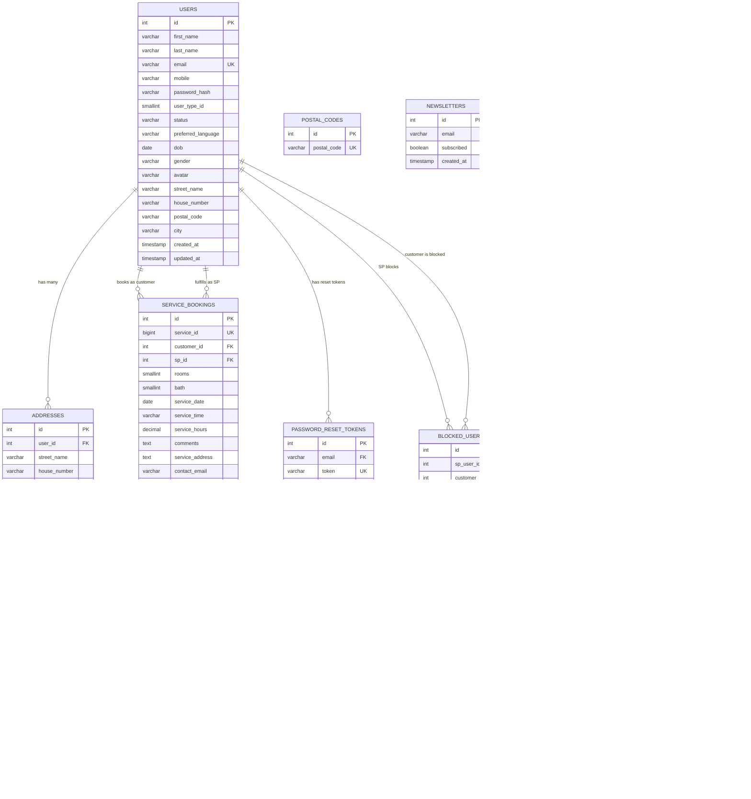
```mermaid
erDiagram
    USERS {
        int id PK
        varchar first_name
        varchar last_name
        varchar email UK
        varchar mobile
        varchar password_hash
        smallint user_type_id
        varchar status
        varchar preferred_language
        date dob
        varchar gender
        varchar avatar
        varchar street_name
        varchar house_number
        varchar postal_code
        varchar city
        timestamp created_at
        timestamp updated_at
    }

    ADDRESSES {
        int id PK
        int user_id FK
        varchar street_name
        varchar house_number
        varchar postal_code
        varchar city
        varchar mobile_number
        timestamp created_at
    }

    SERVICE_BOOKINGS {
        int id PK
        bigint service_id UK
        int customer_id FK
        int sp_id FK
        smallint rooms
        smallint bath
        date service_date
        varchar service_time
        decimal service_hours
        text comments
        text service_address
        varchar contact_email
        varchar contact_mobile
        varchar status
        timestamp booked_at
        decimal total_time
        decimal payment
        decimal effective_payment
        boolean has_pet
        decimal rating
        text sp_comment
        text emp_notes
        text reschedule_reason
        timestamp updated_at
    }

    BOOKING_EXTRA_SERVICES {
        int id PK
        int booking_id FK
        boolean inside_cabinets
        boolean inside_fridge
        boolean inside_oven
        boolean laundry_wash_dry
        boolean interior_windows
    }

    PASSWORD_RESET_TOKENS {
        int id PK
        varchar email FK
        varchar token UK
        bigint expire_time
        boolean used
        timestamp created_at
    }

    BLOCKED_USERS {
        int id PK
        int sp_user_id FK
        int customer_id FK
        boolean is_blocked
        timestamp created_at
    }

    POSTAL_CODES {
        int id PK
        varchar postal_code UK
    }

    NEWSLETTERS {
        int id PK
        varchar email
        boolean subscribed
        timestamp created_at
    }

    FAQS {
        int id PK
        text question
        text answer
        boolean is_active
        timestamp created_at
    }

    COUPONS {
        int id PK
        varchar code UK
        decimal discount_pct
        int max_usage
        int used_count
        boolean is_active
        timestamp expires_at
        timestamp created_at
    }

    USERS ||--o{ ADDRESSES : "has many"
    USERS ||--o{ SERVICE_BOOKINGS : "books as customer"
    USERS ||--o{ SERVICE_BOOKINGS : "fulfills as SP"
    SERVICE_BOOKINGS ||--|| BOOKING_EXTRA_SERVICES : "has one"
    USERS ||--o{ BLOCKED_USERS : "SP blocks"
    USERS ||--o{ BLOCKED_USERS : "customer is blocked"
    USERS ||--o{ PASSWORD_RESET_TOKENS : "has reset tokens"
```

---

## 6. Class Diagram

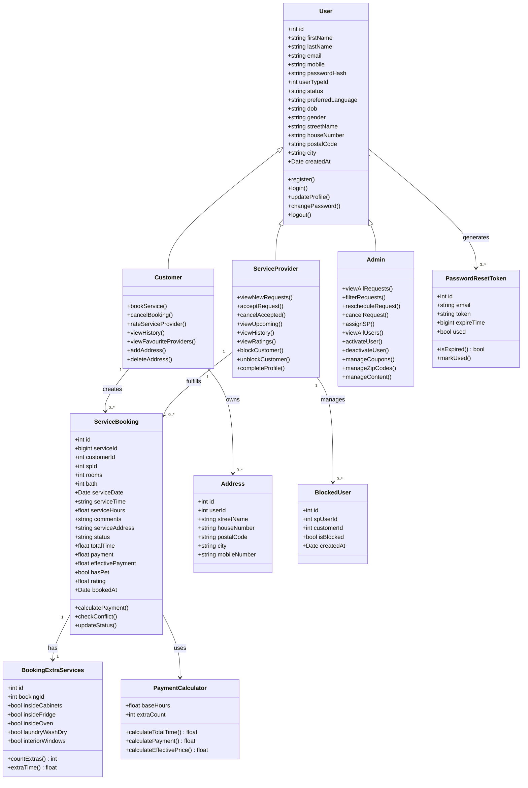
```mermaid
classDiagram
    class User {
        +int id
        +string firstName
        +string lastName
        +string email
        +string mobile
        +string passwordHash
        +int userTypeId
        +string status
        +string preferredLanguage
        +string dob
        +string gender
        +string streetName
        +string houseNumber
        +string postalCode
        +string city
        +Date createdAt
        +register()
        +login()
        +updateProfile()
        +changePassword()
        +logout()
    }

    class Customer {
        +bookService()
        +cancelBooking()
        +rateServiceProvider()
        +viewHistory()
        +viewFavouriteProviders()
        +addAddress()
        +deleteAddress()
    }

    class ServiceProvider {
        +viewNewRequests()
        +acceptRequest()
        +cancelAccepted()
        +viewUpcoming()
        +viewHistory()
        +viewRatings()
        +blockCustomer()
        +unblockCustomer()
        +completeProfile()
    }

    class Admin {
        +viewAllRequests()
        +filterRequests()
        +rescheduleRequest()
        +cancelRequest()
        +assignSP()
        +viewAllUsers()
        +activateUser()
        +deactivateUser()
        +manageCoupons()
        +manageZipCodes()
        +manageContent()
    }

    class ServiceBooking {
        +int id
        +bigint serviceId
        +int customerId
        +int spId
        +int rooms
        +int bath
        +Date serviceDate
        +string serviceTime
        +float serviceHours
        +string comments
        +string serviceAddress
        +string status
        +float totalTime
        +float payment
        +float effectivePayment
        +bool hasPet
        +float rating
        +Date bookedAt
        +calculatePayment()
        +checkConflict()
        +updateStatus()
    }

    class BookingExtraServices {
        +int id
        +int bookingId
        +bool insideCabinets
        +bool insideFridge
        +bool insideOven
        +bool laundryWashDry
        +bool interiorWindows
        +countExtras() int
        +extraTime() float
    }

    class Address {
        +int id
        +int userId
        +string streetName
        +string houseNumber
        +string postalCode
        +string city
        +string mobileNumber
    }

    class PasswordResetToken {
        +int id
        +string email
        +string token
        +bigint expireTime
        +bool used
        +isExpired() bool
        +markUsed()
    }

    class BlockedUser {
        +int id
        +int spUserId
        +int customerId
        +bool isBlocked
        +Date createdAt
    }

    class PaymentCalculator {
        +float baseHours
        +int extraCount
        +calculateTotalTime() float
        +calculatePayment() float
        +calculateEffectivePrice() float
    }

    User <|-- Customer
    User <|-- ServiceProvider
    User <|-- Admin
    Customer "1" --> "0..*" ServiceBooking : creates
    ServiceProvider "1" --> "0..*" ServiceBooking : fulfills
    ServiceBooking "1" --> "1" BookingExtraServices : has
    ServiceBooking --> PaymentCalculator : uses
    Customer "1" --> "0..*" Address : owns
    User "1" --> "0..*" PasswordResetToken : generates
    ServiceProvider "1" --> "0..*" BlockedUser : manages
```

---

## 7. Sequence Diagrams

### 7.1 Login & Authentication Sequence

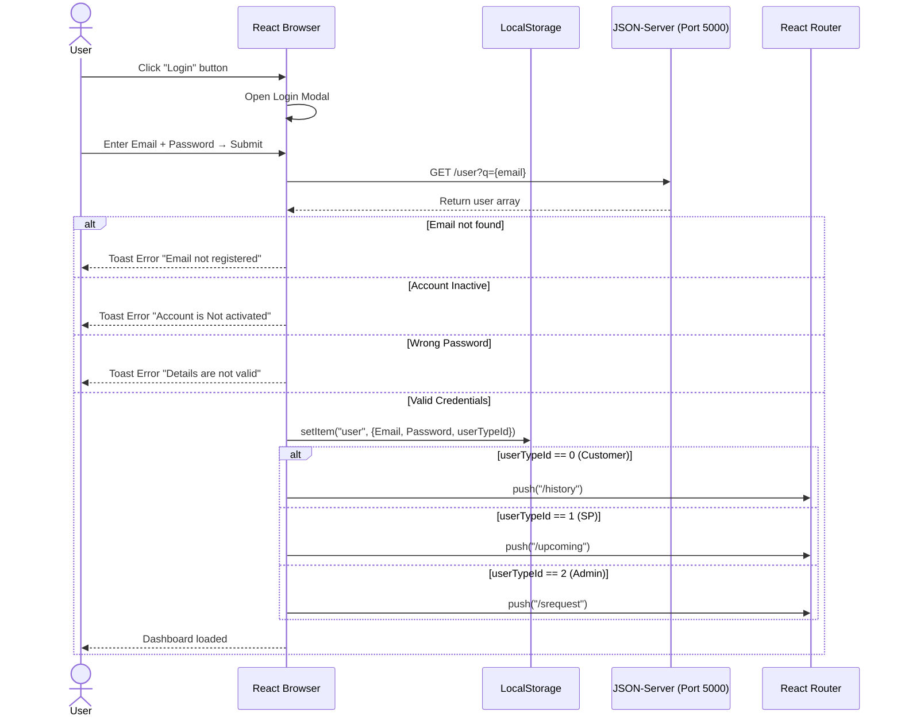
```mermaid
sequenceDiagram
    actor User
    participant Browser as React Browser
    participant LocalStorage
    participant API as JSON-Server (Port 5000)
    participant Router as React Router

    User->>Browser: Click "Login" button
    Browser->>Browser: Open Login Modal
    User->>Browser: Enter Email + Password → Submit
    Browser->>API: GET /user?q={email}
    API-->>Browser: Return user array

    alt Email not found
        Browser-->>User: Toast Error "Email not registered"
    else Account Inactive
        Browser-->>User: Toast Error "Account is Not activated"
    else Wrong Password
        Browser-->>User: Toast Error "Details are not valid"
    else Valid Credentials
        Browser->>LocalStorage: setItem("user", {Email, Password, userTypeId})
        alt userTypeId == 0 (Customer)
            Browser->>Router: push("/history")
        else userTypeId == 1 (SP)
            Browser->>Router: push("/upcoming")
        else userTypeId == 2 (Admin)
            Browser->>Router: push("/srequest")
        end
        Browser-->>User: Dashboard loaded
    end
```

---

### 7.2 User Registration Sequence

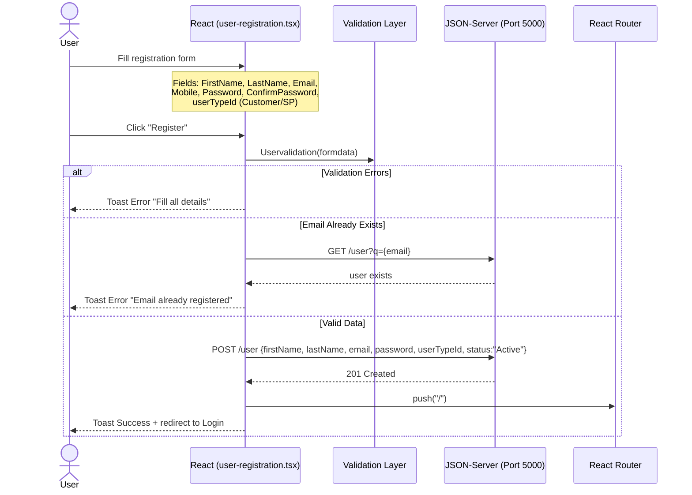
```mermaid
sequenceDiagram
    actor User
    participant Browser as React (user-registration.tsx)
    participant Validator as Validation Layer
    participant API as JSON-Server (Port 5000)
    participant Router as React Router

    User->>Browser: Fill registration form
    Note over Browser: Fields: FirstName, LastName, Email,<br/>Mobile, Password, ConfirmPassword,<br/>userTypeId (Customer/SP)
    User->>Browser: Click "Register"
    Browser->>Validator: Uservalidation(formdata)
    
    alt Validation Errors
        Browser-->>User: Toast Error "Fill all details"
    else Email Already Exists
        Browser->>API: GET /user?q={email}
        API-->>Browser: user exists
        Browser-->>User: Toast Error "Email already registered"
    else Valid Data
        Browser->>API: POST /user {firstName, lastName, email, password, userTypeId, status:"Active"}
        API-->>Browser: 201 Created
        Browser->>Router: push("/")
        Browser-->>User: Toast Success + redirect to Login
    end
```

---

### 7.3 Book a Service (Customer) Sequence

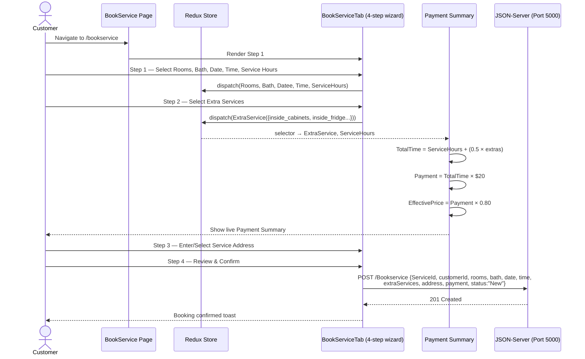
```mermaid
sequenceDiagram
    actor Customer
    participant BS as BookService Page
    participant Redux as Redux Store
    participant Tab as BookServiceTab (4-step wizard)
    participant Payment as Payment Summary
    participant API as JSON-Server (Port 5000)

    Customer->>BS: Navigate to /bookservice
    BS->>Tab: Render Step 1
    
    Customer->>Tab: Step 1 — Select Rooms, Bath, Date, Time, Service Hours
    Tab->>Redux: dispatch(Rooms, Bath, Datee, Time, ServiceHours)
    
    Customer->>Tab: Step 2 — Select Extra Services
    Tab->>Redux: dispatch(ExtraService({inside_cabinets, inside_fridge...}))
    
    Redux-->>Payment: selector → ExtraService, ServiceHours
    Payment->>Payment: TotalTime = ServiceHours + (0.5 × extras)
    Payment->>Payment: Payment = TotalTime × $20
    Payment->>Payment: EffectivePrice = Payment × 0.80
    Payment-->>Customer: Show live Payment Summary
    
    Customer->>Tab: Step 3 — Enter/Select Service Address
    Customer->>Tab: Step 4 — Review & Confirm
    
    Tab->>API: POST /Bookservice {ServiceId, customerId, rooms, bath, date, time,<br/>extraServices, address, payment, status:"New"}
    API-->>Tab: 201 Created
    Tab-->>Customer: Booking confirmed toast
```

---

### 7.4 Accept Service Request (Service Provider) Sequence

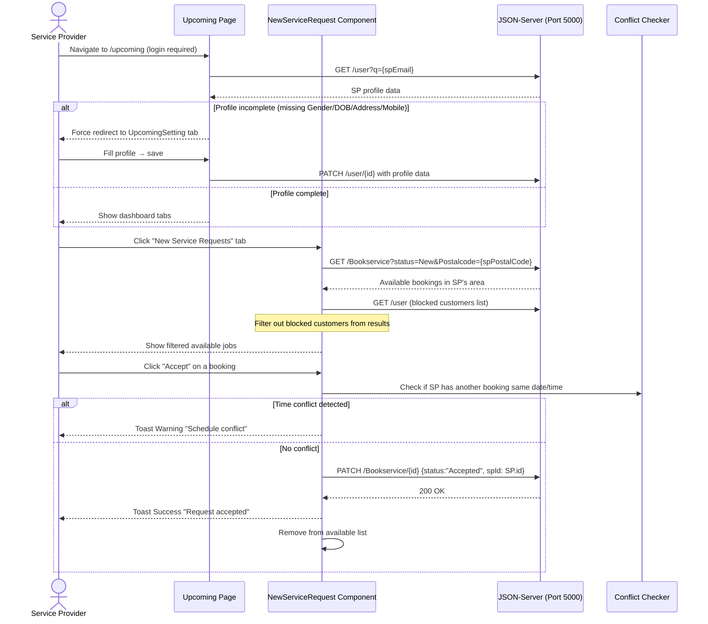
```mermaid
sequenceDiagram
    actor SP as Service Provider
    participant UP as Upcoming Page
    participant NSR as NewServiceRequest Component
    participant API as JSON-Server (Port 5000)
    participant ConflictCheck as Conflict Checker

    SP->>UP: Navigate to /upcoming (login required)
    UP->>API: GET /user?q={spEmail}
    API-->>UP: SP profile data

    alt Profile incomplete (missing Gender/DOB/Address/Mobile)
        UP-->>SP: Force redirect to UpcomingSetting tab
        SP->>UP: Fill profile → save
        UP->>API: PATCH /user/{id} with profile data
    else Profile complete
        UP-->>SP: Show dashboard tabs
    end

    SP->>NSR: Click "New Service Requests" tab
    NSR->>API: GET /Bookservice?status=New&Postalcode={spPostalCode}
    API-->>NSR: Available bookings in SP's area

    NSR->>API: GET /user (blocked customers list)
    Note over NSR: Filter out blocked customers from results
    NSR-->>SP: Show filtered available jobs

    SP->>NSR: Click "Accept" on a booking
    NSR->>ConflictCheck: Check if SP has another booking same date/time
    
    alt Time conflict detected
        NSR-->>SP: Toast Warning "Schedule conflict"
    else No conflict
        NSR->>API: PATCH /Bookservice/{id} {status:"Accepted", spId: SP.id}
        API-->>NSR: 200 OK
        NSR-->>SP: Toast Success "Request accepted"
        NSR->>NSR: Remove from available list
    end
```

---

### 7.5 Forgot Password Sequence

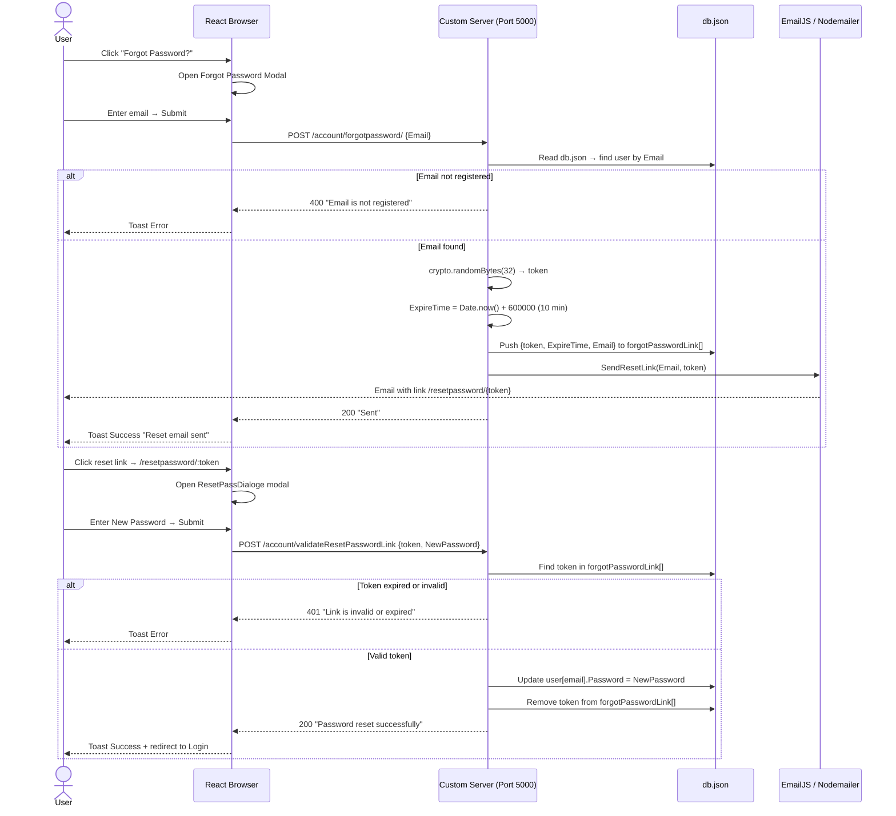
```mermaid
sequenceDiagram
    actor User
    participant Browser as React Browser
    participant API as Custom Server (Port 5000)
    participant DB as db.json
    participant Email as EmailJS / Nodemailer

    User->>Browser: Click "Forgot Password?"
    Browser->>Browser: Open Forgot Password Modal
    User->>Browser: Enter email → Submit
    Browser->>API: POST /account/forgotpassword/ {Email}
    API->>DB: Read db.json → find user by Email
    
    alt Email not registered
        API-->>Browser: 400 "Email is not registered"
        Browser-->>User: Toast Error
    else Email found
        API->>API: crypto.randomBytes(32) → token
        API->>API: ExpireTime = Date.now() + 600000 (10 min)
        API->>DB: Push {token, ExpireTime, Email} to forgotPasswordLink[]
        API->>Email: SendResetLink(Email, token)
        Email-->>User: Email with link /resetpassword/{token}
        API-->>Browser: 200 "Sent"
        Browser-->>User: Toast Success "Reset email sent"
    end

    User->>Browser: Click reset link → /resetpassword/:token
    Browser->>Browser: Open ResetPassDialoge modal
    User->>Browser: Enter New Password → Submit
    Browser->>API: POST /account/validateResetPasswordLink {token, NewPassword}
    API->>DB: Find token in forgotPasswordLink[]
    
    alt Token expired or invalid
        API-->>Browser: 401 "Link is invalid or expired"
        Browser-->>User: Toast Error
    else Valid token
        API->>DB: Update user[email].Password = NewPassword
        API->>DB: Remove token from forgotPasswordLink[]
        API-->>Browser: 200 "Password reset successfully"
        Browser-->>User: Toast Success + redirect to Login
    end
```

---

### 7.6 Admin Manage Service Requests Sequence

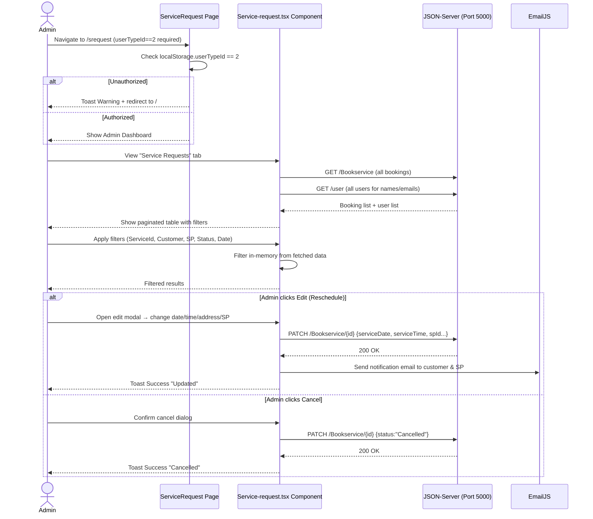
```mermaid
sequenceDiagram
    actor Admin
    participant SR as ServiceRequest Page
    participant SRT as Service-request.tsx Component
    participant API as JSON-Server (Port 5000)
    participant EmailJS as EmailJS

    Admin->>SR: Navigate to /srequest (userTypeId==2 required)
    SR->>SR: Check localStorage.userTypeId == 2
    
    alt Unauthorized
        SR-->>Admin: Toast Warning + redirect to /
    else Authorized
        SR-->>Admin: Show Admin Dashboard
    end

    Admin->>SRT: View "Service Requests" tab
    SRT->>API: GET /Bookservice (all bookings)
    SRT->>API: GET /user (all users for names/emails)
    API-->>SRT: Booking list + user list
    SRT-->>Admin: Show paginated table with filters

    Admin->>SRT: Apply filters (ServiceId, Customer, SP, Status, Date)
    SRT->>SRT: Filter in-memory from fetched data
    SRT-->>Admin: Filtered results

    alt Admin clicks Edit (Reschedule)
        Admin->>SRT: Open edit modal → change date/time/address/SP
        SRT->>API: PATCH /Bookservice/{id} {serviceDate, serviceTime, spId...}
        API-->>SRT: 200 OK
        SRT->>EmailJS: Send notification email to customer & SP
        SRT-->>Admin: Toast Success "Updated"
    else Admin clicks Cancel
        Admin->>SRT: Confirm cancel dialog
        SRT->>API: PATCH /Bookservice/{id} {status:"Cancelled"}
        API-->>SRT: 200 OK
        SRT-->>Admin: Toast Success "Cancelled"
    end
```

---

### 7.7 Block Customer Sequence

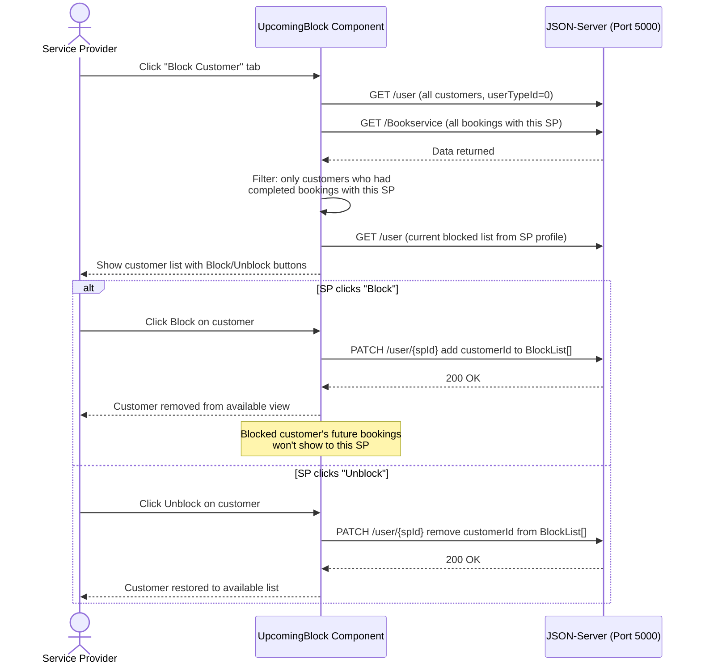
```mermaid
sequenceDiagram
    actor SP as Service Provider
    participant UB as UpcomingBlock Component
    participant API as JSON-Server (Port 5000)

    SP->>UB: Click "Block Customer" tab
    UB->>API: GET /user (all customers, userTypeId=0)
    UB->>API: GET /Bookservice (all bookings with this SP)
    API-->>UB: Data returned
    
    UB->>UB: Filter: only customers who had<br/>completed bookings with this SP
    UB->>API: GET /user (current blocked list from SP profile)
    UB-->>SP: Show customer list with Block/Unblock buttons

    alt SP clicks "Block"
        SP->>UB: Click Block on customer
        UB->>API: PATCH /user/{spId} add customerId to BlockList[]
        API-->>UB: 200 OK
        UB-->>SP: Customer removed from available view
        Note over UB: Blocked customer's future bookings<br/>won't show to this SP
    else SP clicks "Unblock"
        SP->>UB: Click Unblock on customer
        UB->>API: PATCH /user/{spId} remove customerId from BlockList[]
        API-->>UB: 200 OK
        UB-->>SP: Customer restored to available list
    end
```

---

## 8. Activity Diagrams

### 8.1 Customer Booking Activity

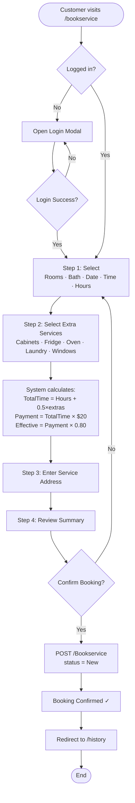
```mermaid
flowchart TD
    START([Customer visits /bookservice]) --> AUTH{Logged in?}
    AUTH -->|No| LOGIN[Open Login Modal]
    LOGIN --> LOGINCHECK{Login Success?}
    LOGINCHECK -->|No| LOGIN
    LOGINCHECK -->|Yes| STEP1
    AUTH -->|Yes| STEP1

    STEP1[Step 1: Select\nRooms · Bath · Date · Time · Hours]
    STEP1 --> STEP2[Step 2: Select Extra Services\nCabinets · Fridge · Oven · Laundry · Windows]
    STEP2 --> CALC[System calculates:\nTotalTime = Hours + 0.5×extras\nPayment = TotalTime × $20\nEffective = Payment × 0.80]
    CALC --> STEP3[Step 3: Enter Service Address]
    STEP3 --> STEP4[Step 4: Review Summary]
    STEP4 --> CONFIRM{Confirm Booking?}
    CONFIRM -->|No| STEP1
    CONFIRM -->|Yes| POST[POST /Bookservice\nstatus = New]
    POST --> SUCCESS[Booking Confirmed ✓]
    SUCCESS --> REDIRECT[Redirect to /history]
    REDIRECT --> END([End])
```

---

### 8.2 Service Provider Activity

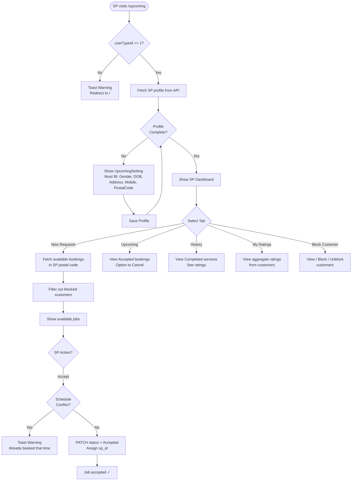
```mermaid
flowchart TD
    START([SP visits /upcoming]) --> AUTH{userTypeId == 1?}
    AUTH -->|No| UNAUTH[Toast Warning\nRedirect to /]
    AUTH -->|Yes| FETCH[Fetch SP profile from API]
    FETCH --> PROFILE{Profile\nComplete?}
    PROFILE -->|No| SETTINGS[Show UpcomingSetting\nMust fill: Gender, DOB,\nAddress, Mobile, PostalCode]
    SETTINGS --> SAVE[Save Profile]
    SAVE --> PROFILE
    PROFILE -->|Yes| DASH[Show SP Dashboard]

    DASH --> TAB{Select Tab}
    TAB --> |New Requests| NR[Fetch available bookings\nin SP postal code]
    NR --> FILTER[Filter out blocked customers]
    FILTER --> SHOW[Show available jobs]
    SHOW --> ACTION{SP Action?}
    ACTION -->|Accept| CONFLICT{Schedule\nConflict?}
    CONFLICT -->|Yes| WARN[Toast Warning\nAlready booked that time]
    CONFLICT -->|No| ACCEPT[PATCH status = Accepted\nAssign sp_id]
    ACCEPT --> DONE[Job accepted ✓]

    TAB -->|Upcoming| UPCOMING[View Accepted bookings\nOption to Cancel]
    TAB -->|History| HISTORY[View Completed services\nSee ratings]
    TAB -->|My Ratings| RATINGS[View aggregate ratings\nfrom customers]
    TAB -->|Block Customer| BLOCK[View / Block / Unblock\ncustomers]
```

---

### 8.3 Admin Activity

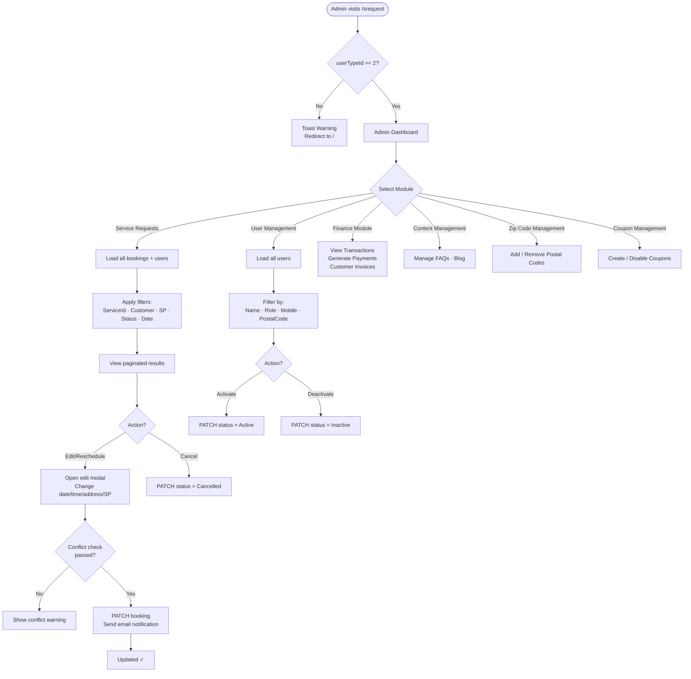
```mermaid
flowchart TD
    START([Admin visits /srequest]) --> AUTH{userTypeId == 2?}
    AUTH -->|No| UNAUTH[Toast Warning\nRedirect to /]
    AUTH -->|Yes| DASH[Admin Dashboard]

    DASH --> MENU{Select Module}

    MENU -->|Service Requests| SR[Load all bookings + users]
    SR --> FILTER[Apply filters:\nServiceId · Customer · SP · Status · Date]
    FILTER --> VIEW[View paginated results]
    VIEW --> ACTION{Action?}
    ACTION -->|Edit/Reschedule| EDIT[Open edit modal\nChange date/time/address/SP]
    EDIT --> CONFLICT{Conflict check\npassed?}
    CONFLICT -->|No| CWARN[Show conflict warning]
    CONFLICT -->|Yes| PATCH1[PATCH booking\nSend email notification]
    PATCH1 --> DONE1[Updated ✓]
    ACTION -->|Cancel| CANCEL[PATCH status = Cancelled]

    MENU -->|User Management| UM[Load all users]
    UM --> UFILTER[Filter by:\nName · Role · Mobile · PostalCode]
    UFILTER --> UACTION{Action?}
    UACTION -->|Activate| ACT[PATCH status = Active]
    UACTION -->|Deactivate| DEACT[PATCH status = Inactive]

    MENU -->|Finance Module| FIN[View Transactions\nGenerate Payments\nCustomer Invoices]
    MENU -->|Content Management| CONT[Manage FAQs · Blog]
    MENU -->|Zip Code Management| ZIP[Add / Remove Postal Codes]
    MENU -->|Coupon Management| COUP[Create / Disable Coupons]
```

---

## 9. State Machine Diagram — Booking Lifecycle

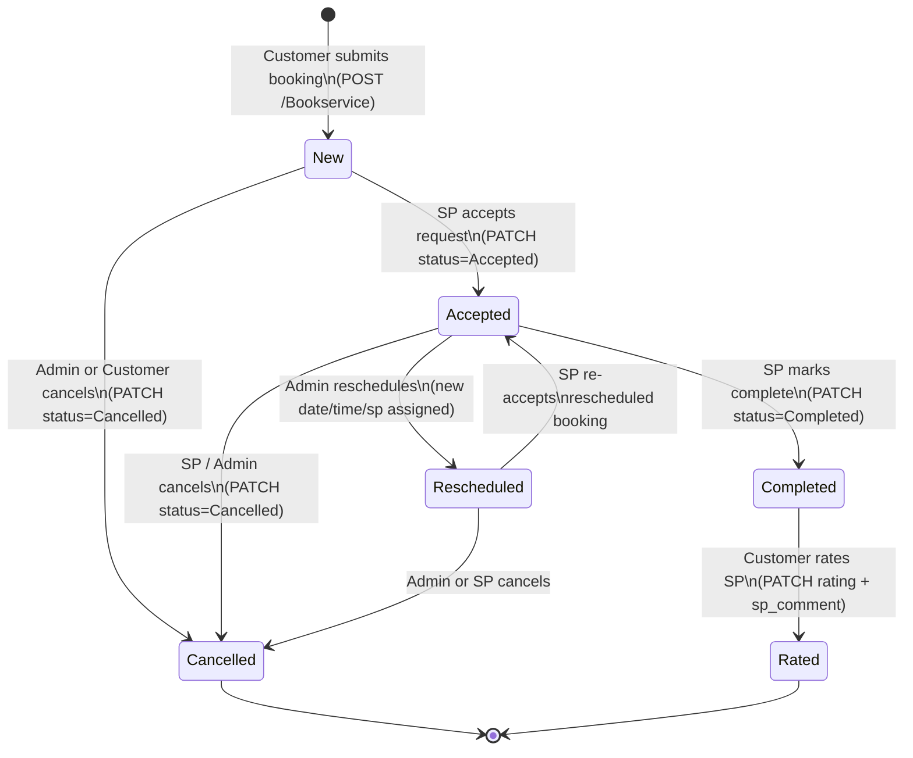
```mermaid
stateDiagram-v2
    [*] --> New : Customer submits booking\n(POST /Bookservice)

    New --> Accepted : SP accepts request\n(PATCH status=Accepted)
    New --> Cancelled : Admin or Customer cancels\n(PATCH status=Cancelled)

    Accepted --> Completed : SP marks complete\n(PATCH status=Completed)
    Accepted --> Cancelled : SP / Admin cancels\n(PATCH status=Cancelled)
    Accepted --> Rescheduled : Admin reschedules\n(new date/time/sp assigned)

    Rescheduled --> Accepted : SP re-accepts\nrescheduled booking
    Rescheduled --> Cancelled : Admin or SP cancels

    Completed --> Rated : Customer rates SP\n(PATCH rating + sp_comment)

    Cancelled --> [*]
    Rated --> [*]
```

---

## 10. Deployment Diagram

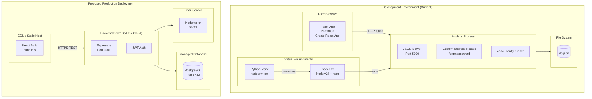
```mermaid
%%{init: {'theme': 'default'}}%%
graph TB
    subgraph DEV["Development Environment (Current)"]
        subgraph BROWSER["User Browser"]
            RC[React App\nPort 3000\nCreate React App]
        end
        subgraph NODE["Node.js Process"]
            JS[JSON-Server\nPort 5000]
            CE[Custom Express Routes\nforgotpassword]
            CON[concurrently runner]
        end
        subgraph FS["File System"]
            DB[(db.json)]
        end
        subgraph VENV["Virtual Environments"]
            PYENV[Python .venv\nnodeenv tool]
            NENV[.nodeenv\nNode v24 + npm]
        end
    end

    subgraph PROD["Proposed Production Deployment"]
        subgraph CLIENT_PROD["CDN / Static Host"]
            BUILD[React Build\nbundle.js]
        end
        subgraph SERVER_PROD["Backend Server (VPS / Cloud)"]
            EXP[Express.js\nPort 3001]
            JWT2[JWT Auth]
        end
        subgraph DB_PROD["Managed Database"]
            PG[(PostgreSQL\nPort 5432)]
        end
        subgraph EMAIL["Email Service"]
            MAIL[Nodemailer\nSMTP]
        end
    end

    BROWSER -->|HTTP :3000| NODE
    NODE --> FS
    PYENV -->|provisions| NENV
    NENV -->|runs| NODE

    BUILD -->|HTTPS REST| SERVER_PROD
    SERVER_PROD --> DB_PROD
    SERVER_PROD --> EMAIL
```

---

## 11. Data Flow Diagram (DFD)

### Level 0 — Context Diagram

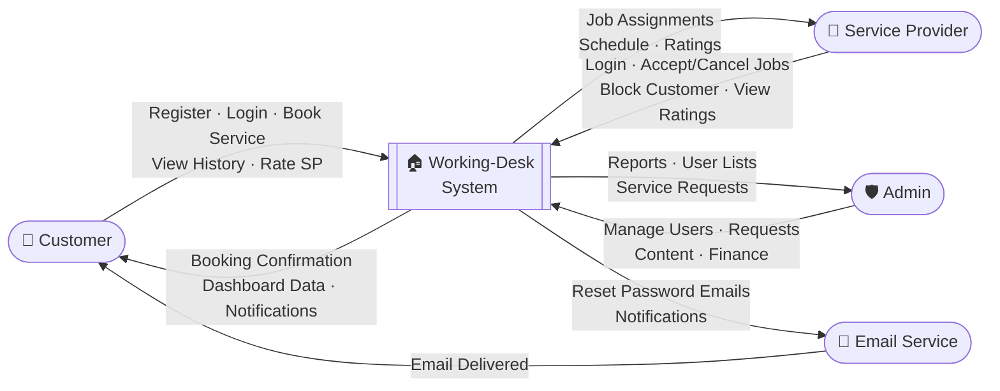
```mermaid
flowchart LR
    C(["👤 Customer"])
    SP(["🧹 Service Provider"])
    ADM(["🛡 Admin"])
    SYS[["🏠 Working-Desk\nSystem"]]
    EMAIL(["📧 Email Service"])

    C -->|"Register · Login · Book Service\nView History · Rate SP"| SYS
    SP -->|"Login · Accept/Cancel Jobs\nBlock Customer · View Ratings"| SYS
    ADM -->|"Manage Users · Requests\nContent · Finance"| SYS
    SYS -->|"Booking Confirmation\nDashboard Data · Notifications"| C
    SYS -->|"Job Assignments\nSchedule · Ratings"| SP
    SYS -->|"Reports · User Lists\nService Requests"| ADM
    SYS -->|"Reset Password Emails\nNotifications"| EMAIL
    EMAIL -->|"Email Delivered"| C
```

### Level 1 — Main Processes

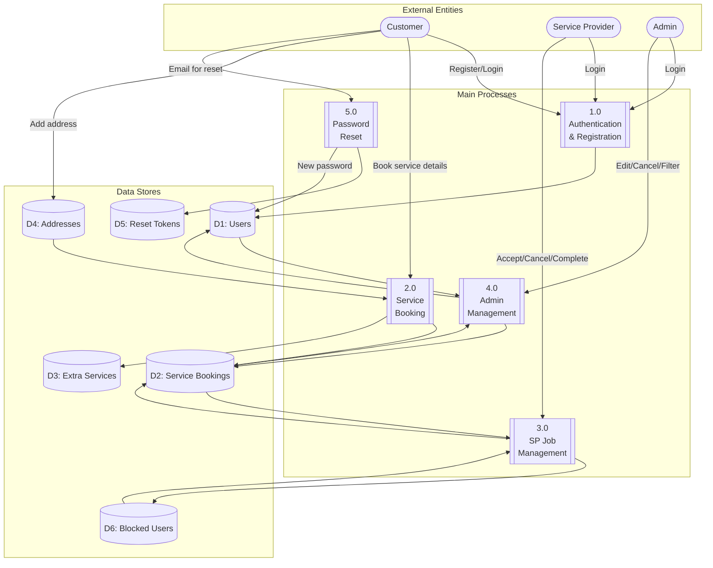
```mermaid
flowchart TD
    subgraph INPUTS["External Entities"]
        C(["Customer"])
        SP(["Service Provider"])
        ADM(["Admin"])
    end

    subgraph PROCESSES["Main Processes"]
        P1[["1.0\nAuthentication\n& Registration"]]
        P2[["2.0\nService\nBooking"]]
        P3[["3.0\nSP Job\nManagement"]]
        P4[["4.0\nAdmin\nManagement"]]
        P5[["5.0\nPassword\nReset"]]
    end

    subgraph DATASTORES["Data Stores"]
        D1[("D1: Users")]
        D2[("D2: Service Bookings")]
        D3[("D3: Extra Services")]
        D4[("D4: Addresses")]
        D5[("D5: Reset Tokens")]
        D6[("D6: Blocked Users")]
    end

    C -->|Register/Login| P1
    SP -->|Login| P1
    ADM -->|Login| P1
    P1 --> D1

    C -->|Book service details| P2
    P2 --> D2
    P2 --> D3
    D4 --> P2
    C -->|Add address| D4

    SP -->|Accept/Cancel/Complete| P3
    D2 --> P3
    D6 --> P3
    P3 --> D2
    P3 --> D6

    ADM -->|Edit/Cancel/Filter| P4
    D1 --> P4
    D2 --> P4
    P4 --> D1
    P4 --> D2

    C -->|Email for reset| P5
    P5 --> D5
    P5 -->|New password| D1
```

---

## 12. Frontend Page & Routing Map

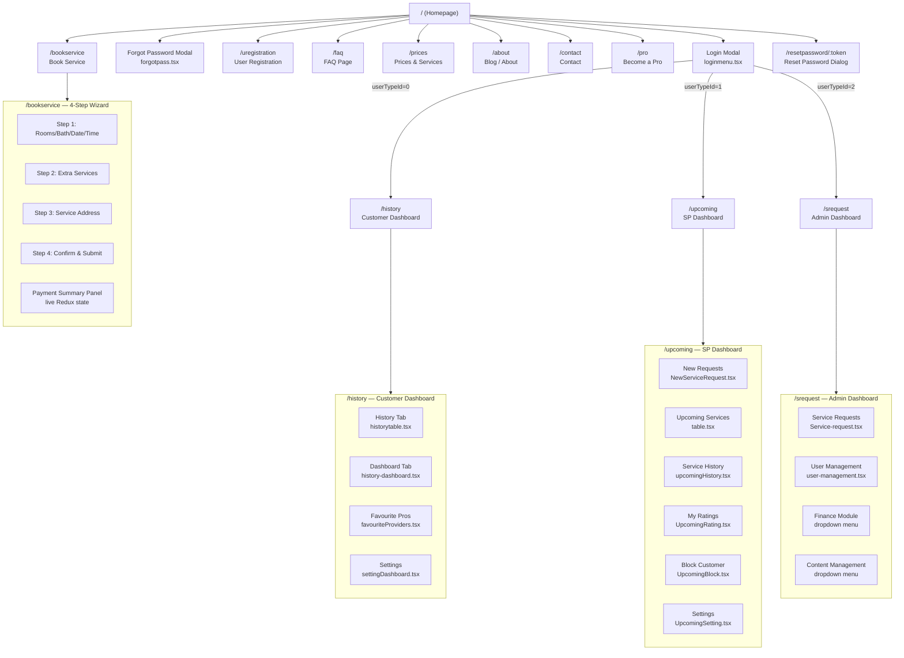
```mermaid
flowchart TD
    ROOT["/  (Homepage)"] --> LOGIN_MODAL["Login Modal\nloginmenu.tsx"]
    ROOT --> FORGOT_MODAL["Forgot Password Modal\nforgotpass.tsx"]
    ROOT --> REG["/uregistration\nUser Registration"]
    ROOT --> FAQ["/faq\nFAQ Page"]
    ROOT --> PRICES["/prices\nPrices & Services"]
    ROOT --> ABOUT["/about\nBlog / About"]
    ROOT --> CONTACT["/contact\nContact"]
    ROOT --> PRO["/pro\nBecome a Pro"]
    ROOT --> BS["/bookservice\nBook Service"]

    LOGIN_MODAL -->|userTypeId=0| HIST["/history\nCustomer Dashboard"]
    LOGIN_MODAL -->|userTypeId=1| UPS["/upcoming\nSP Dashboard"]
    LOGIN_MODAL -->|userTypeId=2| SR["/srequest\nAdmin Dashboard"]

    ROOT --> RESET["/resetpassword/:token\nReset Password Dialog"]

    subgraph CUSTOMER_DASH["/history — Customer Dashboard"]
        H1[History Tab\nhistorytable.tsx]
        H2[Dashboard Tab\nhistory-dashboard.tsx]
        H3[Favourite Pros\nfavouriteProviders.tsx]
        H4[Settings\nsettingDashboard.tsx]
    end

    subgraph SP_DASH["/upcoming — SP Dashboard"]
        U1[New Requests\nNewServiceRequest.tsx]
        U2[Upcoming Services\ntable.tsx]
        U3[Service History\nupcomingHistory.tsx]
        U4[My Ratings\nUpcomingRating.tsx]
        U5[Block Customer\nUpcomingBlock.tsx]
        U6[Settings\nUpcomingSetting.tsx]
    end

    subgraph ADMIN_DASH["/srequest — Admin Dashboard"]
        A1[Service Requests\nService-request.tsx]
        A2[User Management\nuser-management.tsx]
        A3[Finance Module\ndropdown menu]
        A4[Content Management\ndropdown menu]
    end

    HIST --> CUSTOMER_DASH
    UPS --> SP_DASH
    SR --> ADMIN_DASH
    BS --> BS_TABS

    subgraph BS_TABS["/bookservice — 4-Step Wizard"]
        B1[Step 1: Rooms/Bath/Date/Time]
        B2[Step 2: Extra Services]
        B3[Step 3: Service Address]
        B4[Step 4: Confirm & Submit]
        PAY[Payment Summary Panel\nlive Redux state]
    end
```

---

## 13. Redux State Architecture

```mermaid
flowchart LR
    subgraph STORE["Redux Store (store.tsx)"]
        subgraph SLICE["bookserviceRedux Slice"]
            ROOMS[Rooms: number]
            BATH[Bath: number]
            DATE[Date: string]
            TIME[Time: string]
            HOURS[ServiceHours: string]
            EXTRA[ExtraService: object\n5 boolean flags]
            CMTS[Comments: string]
        end
    end

    subgraph DISPATCHERS["Components dispatching actions"]
        TAB[BookServiceTab]
    end

    subgraph SELECTORS["Components reading state"]
        PAY[BookService Page\nPayment Summary]
        BS2[BookService Step 4\nReview Panel]
    end

    TAB -->|dispatch Rooms()| ROOMS
    TAB -->|dispatch Bath()| BATH
    TAB -->|dispatch Datee()| DATE
    TAB -->|dispatch Time()| TIME
    TAB -->|dispatch ServiceHours()| HOURS
    TAB -->|dispatch ExtraService()| EXTRA

    ROOMS -->|useSelector| PAY
    BATH -->|useSelector| PAY
    DATE -->|useSelector| PAY
    TIME -->|useSelector| PAY
    HOURS -->|useSelector → TotalTime calc| PAY
    EXTRA -->|useSelector → +0.5 per extra| PAY
```

---

## 14. REST API Design

### Authentication APIs

| Method | Endpoint | Role | Description |
|--------|----------|------|-------------|
| `POST` | `/api/auth/register` | Public | Register new user |
| `POST` | `/api/auth/login` | Public | Login, returns JWT |
| `POST` | `/api/auth/forgot-password` | Public | Send reset email |
| `POST` | `/api/auth/reset-password` | Public | Validate token & reset password |
| `PATCH` | `/api/auth/change-password` | Auth | Change own password |

### User APIs

| Method | Endpoint | Role | Description |
|--------|----------|------|-------------|
| `GET` | `/api/users` | Admin | List all users with filters |
| `GET` | `/api/users/me` | Auth | Get own profile |
| `PUT` | `/api/users/:id` | Auth/Admin | Update user profile |
| `PATCH` | `/api/users/:id/status` | Admin | Activate / Deactivate user |

### Address APIs

| Method | Endpoint | Role | Description |
|--------|----------|------|-------------|
| `GET` | `/api/addresses?userId=x` | Auth | Get addresses for user |
| `POST` | `/api/addresses` | Auth | Add new address |
| `PUT` | `/api/addresses/:id` | Auth | Edit address |
| `DELETE` | `/api/addresses/:id` | Auth | Delete address |

### Booking APIs

| Method | Endpoint | Role | Description |
|--------|----------|------|-------------|
| `POST` | `/api/bookings` | Customer | Book a new service |
| `GET` | `/api/bookings?userId=x` | Customer | Customer's booking history |
| `GET` | `/api/bookings/available` | SP | New requests in SP's postal code |
| `GET` | `/api/bookings/upcoming` | SP | SP's upcoming accepted bookings |
| `GET` | `/api/bookings/history` | SP | SP's completed services |
| `PATCH` | `/api/bookings/:id/accept` | SP | Accept a service request |
| `PATCH` | `/api/bookings/:id/cancel` | SP/Customer/Admin | Cancel booking |
| `PATCH` | `/api/bookings/:id/complete` | SP | Mark as completed |
| `PATCH` | `/api/bookings/:id/rate` | Customer | Rate SP after completion |
| `PATCH` | `/api/bookings/:id/reschedule` | Admin | Reschedule with conflict check |
| `GET` | `/api/bookings` | Admin | All bookings with filters |

### Admin APIs

| Method | Endpoint | Role | Description |
|--------|----------|------|-------------|
| `GET` | `/api/admin/service-requests` | Admin | All service requests, paginated |
| `PATCH` | `/api/admin/users/:id/status` | Admin | Activate/Deactivate |
| `GET` | `/api/admin/postal-codes` | Admin | Manage zip codes |
| `POST` | `/api/admin/postal-codes` | Admin | Add zip code |
| `GET` | `/api/admin/coupons` | Admin | Coupon management |
| `POST` | `/api/admin/coupons` | Admin | Create coupon |
| `GET` | `/api/admin/faqs` | Admin | FAQ management |
| `POST` | `/api/admin/faqs` | Admin | Create FAQ |

### Block User APIs

| Method | Endpoint | Role | Description |
|--------|----------|------|-------------|
| `POST` | `/api/block-users` | SP | Block a customer |
| `GET` | `/api/block-users` | SP | Get SP's blocked list |
| `DELETE` | `/api/block-users/:id` | SP | Unblock customer |

---

## 15. PostgreSQL Database Schema

```sql
-- Table 1: Users (all roles)
CREATE TABLE users (
    id                  SERIAL PRIMARY KEY,
    first_name          VARCHAR(100)  NOT NULL,
    last_name           VARCHAR(100)  NOT NULL,
    email               VARCHAR(255)  UNIQUE NOT NULL,
    mobile              VARCHAR(20),
    password_hash       VARCHAR(255)  NOT NULL,
    user_type_id        SMALLINT      NOT NULL DEFAULT 0,  -- 0=Customer, 1=SP, 2=Admin
    status              VARCHAR(20)   NOT NULL DEFAULT 'Active',
    preferred_language  VARCHAR(50)   DEFAULT 'English',
    dob                 DATE,
    gender              VARCHAR(20),
    avatar              VARCHAR(50),
    street_name         VARCHAR(255),
    house_number        VARCHAR(50),
    postal_code         VARCHAR(20),
    city                VARCHAR(100),
    created_at          TIMESTAMP     DEFAULT NOW(),
    updated_at          TIMESTAMP     DEFAULT NOW()
);

-- Table 2: Customer addresses
CREATE TABLE addresses (
    id              SERIAL PRIMARY KEY,
    user_id         INT           NOT NULL REFERENCES users(id) ON DELETE CASCADE,
    street_name     VARCHAR(255)  NOT NULL,
    house_number    VARCHAR(50)   NOT NULL,
    postal_code     VARCHAR(20)   NOT NULL,
    city            VARCHAR(100)  NOT NULL,
    mobile_number   VARCHAR(20),
    created_at      TIMESTAMP     DEFAULT NOW()
);
CREATE INDEX idx_addresses_user_id ON addresses(user_id);

-- Table 3: Service bookings
CREATE TABLE service_bookings (
    id                  SERIAL PRIMARY KEY,
    service_id          BIGINT        UNIQUE NOT NULL,
    customer_id         INT           NOT NULL REFERENCES users(id),
    sp_id               INT           REFERENCES users(id),
    rooms               SMALLINT      DEFAULT 0,
    bath                SMALLINT      DEFAULT 0,
    service_date        DATE          NOT NULL,
    service_time        VARCHAR(20)   NOT NULL,
    service_hours       DECIMAL(4,1)  NOT NULL,
    comments            TEXT,
    service_address     TEXT          NOT NULL,
    contact_email       VARCHAR(255),
    contact_mobile      VARCHAR(20),
    status              VARCHAR(30)   NOT NULL DEFAULT 'New',
    booked_at           TIMESTAMP     DEFAULT NOW(),
    total_time          DECIMAL(4,1),
    payment             DECIMAL(10,2),
    effective_payment   DECIMAL(10,2),
    has_pet             BOOLEAN       DEFAULT FALSE,
    rating              DECIMAL(3,2),
    sp_comment          TEXT,
    emp_notes           TEXT,
    reschedule_reason   TEXT,
    updated_at          TIMESTAMP     DEFAULT NOW()
);
CREATE INDEX idx_bookings_customer ON service_bookings(customer_id);
CREATE INDEX idx_bookings_sp       ON service_bookings(sp_id);
CREATE INDEX idx_bookings_status   ON service_bookings(status);
CREATE INDEX idx_bookings_date     ON service_bookings(service_date);

-- Table 4: Extra services per booking
CREATE TABLE booking_extra_services (
    id                  SERIAL PRIMARY KEY,
    booking_id          INT       NOT NULL REFERENCES service_bookings(id) ON DELETE CASCADE,
    inside_cabinets     BOOLEAN   DEFAULT FALSE,
    inside_fridge       BOOLEAN   DEFAULT FALSE,
    inside_oven         BOOLEAN   DEFAULT FALSE,
    laundry_wash_dry    BOOLEAN   DEFAULT FALSE,
    interior_windows    BOOLEAN   DEFAULT FALSE
);

-- Table 5: Password reset tokens
CREATE TABLE password_reset_tokens (
    id          SERIAL PRIMARY KEY,
    email       VARCHAR(255)  NOT NULL REFERENCES users(email) ON DELETE CASCADE,
    token       VARCHAR(255)  UNIQUE NOT NULL,
    expire_time BIGINT        NOT NULL,
    used        BOOLEAN       DEFAULT FALSE,
    created_at  TIMESTAMP     DEFAULT NOW()
);

-- Table 6: SP-blocked customers
CREATE TABLE blocked_users (
    id              SERIAL PRIMARY KEY,
    sp_user_id      INT       NOT NULL REFERENCES users(id) ON DELETE CASCADE,
    customer_id     INT       NOT NULL REFERENCES users(id) ON DELETE CASCADE,
    is_blocked      BOOLEAN   DEFAULT TRUE,
    created_at      TIMESTAMP DEFAULT NOW(),
    UNIQUE(sp_user_id, customer_id)
);

-- Table 7: Valid postal codes
CREATE TABLE postal_codes (
    id           SERIAL PRIMARY KEY,
    postal_code  VARCHAR(20)  UNIQUE NOT NULL
);

-- Table 8: Newsletter subscriptions
CREATE TABLE newsletters (
    id          SERIAL PRIMARY KEY,
    email       VARCHAR(255) NOT NULL,
    subscribed  BOOLEAN      DEFAULT TRUE,
    created_at  TIMESTAMP    DEFAULT NOW()
);

-- Table 9: FAQ content
CREATE TABLE faqs (
    id          SERIAL PRIMARY KEY,
    question    TEXT    NOT NULL,
    answer      TEXT    NOT NULL,
    is_active   BOOLEAN DEFAULT TRUE,
    created_at  TIMESTAMP DEFAULT NOW()
);

-- Table 10: Discount coupons
CREATE TABLE coupons (
    id              SERIAL PRIMARY KEY,
    code            VARCHAR(50)   UNIQUE NOT NULL,
    discount_pct    DECIMAL(5,2),
    max_usage       INT,
    used_count      INT           DEFAULT 0,
    is_active       BOOLEAN       DEFAULT TRUE,
    expires_at      TIMESTAMP,
    created_at      TIMESTAMP     DEFAULT NOW()
);
```

---

## 16. Security Design

### Current vs Proposed Security

| Feature | Current (JSON-Server) | Proposed (PostgreSQL + Express) |
|---------|----------------------|---------------------------------|
| **Passwords** | Plain text in db.json ❌ | bcrypt hashed (cost factor 12) ✅ |
| **Authentication** | localStorage plain object ❌ | JWT (7d expiry) + HttpOnly Cookie ✅ |
| **Authorization** | Client-side `userTypeId` check ❌ | Server-side JWT middleware guard ✅ |
| **SQL Injection** | N/A (JSON) | Parameterized queries via `pg` ✅ |
| **Data Integrity** | None ❌ | FK constraints + UNIQUE indexes ✅ |
| **Concurrent Writes** | File lock conflicts ❌ | ACID PostgreSQL transactions ✅ |
| **Token Expiry** | Manual timestamp check | JWT expiry + DB expiry column ✅ |
| **CORS** | Open CORS ❌ | Whitelist origin in production ✅ |

### JWT Auth Flow (Proposed)

```mermaid
sequenceDiagram
    participant Browser
    participant Express
    participant JWT as JWT Library
    participant PG as PostgreSQL

    Browser->>Express: POST /api/auth/login {email, password}
    Express->>PG: SELECT * FROM users WHERE email=$1
    PG-->>Express: User row
    Express->>JWT: bcrypt.compare(password, hash)
    JWT-->>Express: valid=true
    Express->>JWT: sign({userId, userTypeId}, SECRET, {expiresIn:'7d'})
    JWT-->>Express: token string
    Express-->>Browser: 200 {token, userTypeId}
    
    Browser->>Express: GET /api/bookings\nAuthorization: Bearer {token}
    Express->>JWT: jwt.verify(token, SECRET)
    JWT-->>Express: {userId, userTypeId, exp}
    
    alt Token expired or invalid
        Express-->>Browser: 401 Unauthorized
    else Valid
        Express->>PG: Execute protected query
        PG-->>Express: Data
        Express-->>Browser: 200 Data
    end
```

---

## 17. Business Logic Rules

### Payment Calculation
```
Base Hours       = ServiceHours (user selected: 1.5 – 6 hrs)
Extra Time       = 0.5 hrs × number of extra services checked
                   (Inside cabinets, fridge, oven, laundry, interior windows)
Total Time       = Base Hours + Extra Time
Payment          = Total Time × $20/hr
Effective Price  = Payment × 0.80  (20% tax deduction §35a EStG)
```

### SP Conflict Detection Logic
```sql
-- Check if SP already has an accepted booking that overlaps
SELECT * FROM service_bookings
WHERE sp_id = $spId
  AND service_date = $proposedDate
  AND status = 'Accepted'
  AND id != $bookingId;

-- Then in application layer check time overlap:
-- booking.startTime to (booking.startTime + booking.serviceHours)
-- vs proposed startTime to (proposed.startTime + proposed.serviceHours)
```

### SP Matching Query (Available Jobs)
```sql
SELECT sb.* FROM service_bookings sb
WHERE sb.status = 'New'
  AND sb.postal_code = $spPostalCode
  AND sb.customer_id NOT IN (
      SELECT customer_id
      FROM blocked_users
      WHERE sp_user_id = $spId AND is_blocked = TRUE
  );
```

### Profile Completeness Check (SP)
A Service Provider cannot accept jobs unless their profile has all of:
- `Gender` (not null/undefined)
- `DOB` (not null/undefined)
- `StreetName` (not null/undefined)
- `HouseNumber` (not null/undefined)
- `PostalCode` (not null/undefined)
- `City` (not null/undefined)
- `MobileNumber` (not null/undefined)

---

## 18. Technology Stack

### Current Stack

| Layer | Technology | Version |
|-------|-----------|---------|
| **Frontend Framework** | React | 17.0.2 |
| **Language** | TypeScript | 4.5.4 |
| **UI Components** | MUI (Material UI) | v5.2.6 |
| **Legacy UI** | @material-ui/core | v4.12.3 |
| **State Management** | Redux Toolkit | 1.8.1 |
| **HTTP Client** | fetch (native browser) | — |
| **Routing** | React Router DOM | v5.3.0 |
| **Form Validation** | Custom + validator.js | 13.7.0 |
| **Notifications** | React Toastify | 8.2.0 |
| **Email (client)** | emailjs-com | 3.2.0 |
| **Date Utils** | moment.js + date-fns | — |
| **Backend** | JSON-Server + Node.js | 0.17.0 |
| **Custom Routes** | Express.js (embedded) | — |
| **Email (server)** | Nodemailer (sendmail.js) | — |
| **Crypto** | Node.js crypto module | built-in |
| **Database** | db.json flat file | — |
| **Node Runtime** | Node.js (via nodeenv) | v24.14.0 |
| **Package Manager** | npm | 11.9.0 |

### Proposed Production Stack

| Layer | Technology |
|-------|-----------|
| **Frontend** | React 17 + TypeScript + MUI v5 + Redux Toolkit |
| **Backend** | Node.js + Express.js |
| **Database** | PostgreSQL 15+ |
| **ORM/Query** | `pg` (node-postgres) with parameterized queries |
| **Auth** | `jsonwebtoken` + `bcrypt` |
| **Email** | Nodemailer (SMTP) |
| **Validation** | Joi / express-validator |
| **Build Tool** | Create React App → Webpack 5 |

### Proposed Backend Folder Structure

```
server/
├── package.json
├── .env
├── app.js                      ← Express app entry
├── config/
│   └── db.js                   ← PostgreSQL connection pool (pg)
├── middleware/
│   ├── auth.js                 ← JWT verification
│   └── role.js                 ← Role guard (customer/SP/admin)
├── routes/
│   ├── auth.routes.js
│   ├── user.routes.js
│   ├── address.routes.js
│   ├── booking.routes.js
│   ├── block.routes.js
│   └── admin.routes.js
├── controllers/
│   ├── auth.controller.js
│   ├── user.controller.js
│   ├── address.controller.js
│   ├── booking.controller.js
│   ├── block.controller.js
│   └── admin.controller.js
├── services/
│   ├── email.service.js        ← Nodemailer
│   └── conflict.service.js     ← SP schedule conflict check
└── db/
    └── schema.sql              ← Full PostgreSQL schema
```

### Environment Variables (`.env`)

```env
# Server
PORT=3001
NODE_ENV=development

# PostgreSQL
DB_HOST=localhost
DB_PORT=5432
DB_NAME=workingdesk_db
DB_USER=postgres
DB_PASSWORD=your_password

# JWT
JWT_SECRET=your_super_secret_key
JWT_EXPIRES_IN=7d

# Email (Nodemailer)
EMAIL_HOST=smtp.gmail.com
EMAIL_PORT=587
EMAIL_USER=your@gmail.com
EMAIL_PASS=your_app_password

# Frontend
FRONTEND_URL=http://localhost:3000
```

---

> **Generated for:** Working-Desk-master2 | **Date:** March 2026  
> All diagrams use [Mermaid](https://mermaid.js.org/) syntax — render in GitHub, GitLab, Notion, or any Mermaid-compatible viewer.
